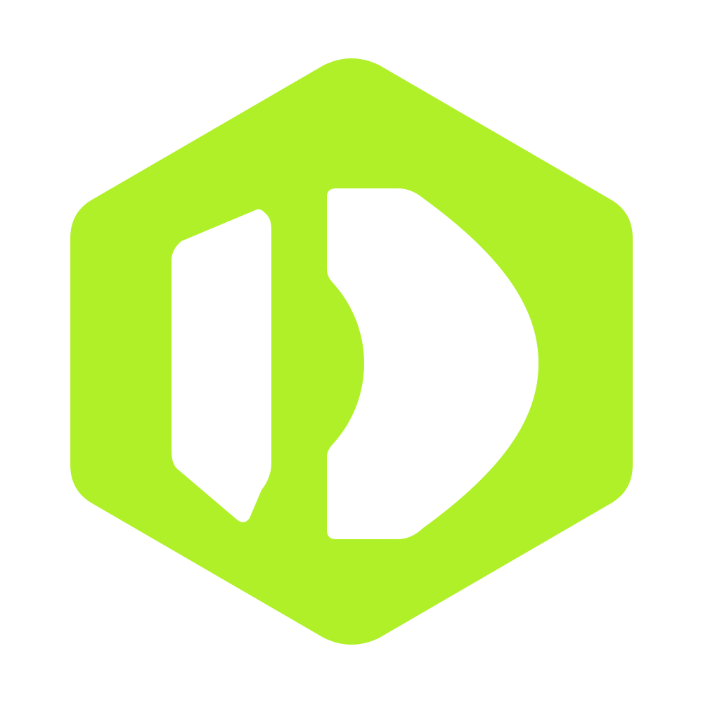

<div align="center">



# Duesora

**Know what you own. Know what's due.**

A free, open-source renewal, expiry, ownership, and recurring-cost management platform for developers, teams, agencies, and modern businesses.

[](LICENSE)
[](https://nextjs.org/)
[](https://react.dev/)
[](https://www.typescriptlang.org/)
[](https://tailwindcss.com/)
[](https://www.postgresql.org/)
[](https://buymeacoffee.com/adarshk3113)
[](CONTRIBUTING.md)

</div>

---

## 💡 What is Duesora?

Modern organizations and indie hackers manage dozens of scattered assets—domains at multiple registrars, SSL/TLS certificates, cloud subscriptions, developer APIs, software licenses, vendor agreements, and office warranties. 

Surprise card charges and unexpected service outages occur because nobody knew:
1. **What assets exist?**
2. **Who owns them?**
3. **What do they cost?**
4. **When do they renew or expire?**

**Duesora** unifies your entire asset portfolio into a single, proactive dashboard with multi-tenant isolation, automated reminders, and granular cost tracking.

---

## 🚀 Key Highlights & Capabilities

- 🌐 **Comprehensive Asset Portfolio**: Track domains, SSL certificates, SaaS tools, cloud infrastructure, API subscriptions, warranties, and custom contracts.
- 👥 **Clear Ownership & Workspaces**: Eliminate orphaned resources with designated owners, team workspaces, and role-based access control (RBAC).
- 💸 **Cost & Recurring Spend Analytics**: Monitor monthly and annual renewal commitments, multi-currency costs, and historical spending.
- ⏰ **Proactive Alert Engine**: Receive renewal notifications before critical expiration deadlines through in-app alerts, email digests, and webhooks.
- 🔒 **Self-Hosted & Privacy-First**: 100% control of your data. Zero telemetry by default, no artificial feature gates, and no mandatory cloud dependencies.
- 🎨 **Enterprise-Grade UI**: Designed with a sleek, dark-mode-first interface, micro-animations, and full accessibility compliance (WCAG AA).

---

## 🎨 Design System & Mockups

Duesora includes a complete 22-page desktop UI specification and design matrix:

- 📐 [Design System & UI Story Specifications](docs/assets/designs/README.md)
- 🖼️ [High-Fidelity UI Mockups Directory](docs/assets/designs/mockups/)

---

## 🛠️ Technology Stack

| Layer | Technologies |
|---|---|
| **Framework** | [Next.js 16](https://nextjs.org) (App Router, Turbopack, Server Components) |
| **Frontend** | [React 19](https://react.dev), [Tailwind CSS v4](https://tailwindcss.com), [Lucide Icons](https://lucide.dev) |
| **Database & ORM** | [PostgreSQL 16](https://www.postgresql.org), [Drizzle ORM](https://orm.drizzle.team) |
| **Authentication** | [NextAuth.js (Auth.js v5)](https://authjs.dev) |
| **Queues & Caching** | [Redis 7](https://redis.io), [BullMQ](https://bullmq.io) |
| **Validation & Types** | [TypeScript 5](https://www.typescriptlang.org), [Zod v4](https://zod.dev) |
| **Testing** | [Vitest](https://vitest.dev) |

---

## ⚡ Quick Start

### Prerequisites
- [Node.js](https://nodejs.org) >= 20.0.0
- [Docker & Docker Compose](https://www.docker.com/)

### 1. Clone the Repository
```bash
git clone https://github.com/Adarshkumar76/duesora.git
cd duesora
```

### 2. Configure Environment Variables
Copy the example environment configuration:
```bash
cp .env.example .env.local
```

### 3. Start Database Services
Launch PostgreSQL and Redis via Docker Compose:
```bash
docker compose up -d
```

### 4. Install Dependencies
```bash
npm install
```

### 5. Start the Development Server
```bash
npm run dev
```

Open [http://localhost:3000](http://localhost:3000) in your browser to explore Duesora.

---

## 📋 Available Scripts

Run these scripts directly from the project root:

| Command | Description |
|---|---|
| `npm run dev` | Start the Next.js local development server with Turbopack |
| `npm run build` | Compile and generate optimized production bundle |
| `npm run start` | Run the Next.js production server |
| `npm test` | Execute the unit test suite via Vitest |
| `npm run lint` | Run ESLint across all codebase files |

---

## 📚 Documentation Map

Complete operational and architecture guides are available in the [`docs/`](docs/) directory:

| Section | Description | Key Documents |
|---|---|---|
| 🏛️ **Architecture** | System architecture, data modeling, and security boundaries | [System Architecture](docs/architecture/ARCHITECTURE.md) • [Database Schema](docs/architecture/DATABASE_SCHEMA.md) • [Security](docs/architecture/SECURITY_ARCHITECTURE.md) • [API Design](docs/architecture/API_DESIGN.md) |
| 🎯 **Product** | Strategy, feature specifications, and development roadmap | [Product Scope](docs/product/PRODUCT.md) • [Features](docs/product/FEATURES.md) • [Roadmap](docs/product/ROADMAP.md) • [Branding](docs/product/BRANDING.md) |
| 🛠️ **Development** | Contribution workflows, coding conventions, and testing | [Engineering Standards](docs/development/ENGINEERING_STANDARDS.md) • [Testing](docs/development/TESTING.md) • [Branching](docs/development/BRANCHING_AND_CONTRIBUTION_WORKFLOW.md) |
| ⚙️ **Operations** | Self-hosting, container deployments, and maintenance | [Deployment Guide](docs/operations/DEPLOYMENT.md) • [Docker](docs/operations/DOCKER.md) • [CI/CD](docs/operations/CI_CD.md) • [Backup & Restore](docs/operations/BACKUP_RESTORE.md) |
| 📜 **ADRs** | Architectural Decision Records | [ADR Index](docs/adr/README.md) • [PostgreSQL (0001)](docs/adr/0001-use-postgresql.md) • [SSRF Isolation (0002)](docs/adr/0002-security-first-monitor-workers.md) |
| ⚖️ **Legal & Governance** | Open source hygiene, privacy, and community leadership | [Privacy Principles](docs/legal/PRIVACY.md) • [Self-Hosted Terms](docs/legal/TERMS_SELF_HOSTED.md) • [Governance](docs/community/GOVERNANCE.md) |

For a complete catalog, see the [Documentation Index](docs/README.md).

---

## 🛡️ Security & Responsible Disclosure

Security is fundamental to Duesora. If you discover a vulnerability or security risk, please review our [Security Policy](SECURITY.md) and report it responsibly rather than opening a public issue.

---

## 🤝 Contributing

We welcome community contributions! Please check out our [Contributing Guidelines](CONTRIBUTING.md) and [Code of Conduct](CODE_OF_CONDUCT.md) before submitting pull requests.

---

## ☕ Support & Sponsorship

If Duesora helps you track your assets and prevent unexpected renewals, consider supporting its open-source development:

[](https://buymeacoffee.com/adarshk3113)

---

## ⚖️ License

Duesora is open-source software licensed under the [MIT License](LICENSE).  
Brand assets, names, and logos are governed by our [Trademark Policy](TRADEMARK.md).
